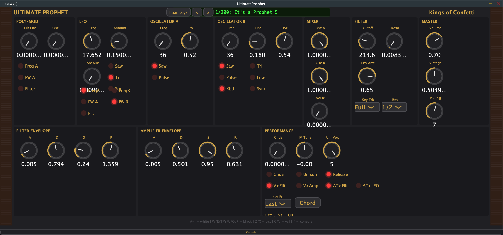

# Ultimate Prophet



**The most authentic Prophet-5 virtual analog synthesizer ever built.**

A circuit-level recreation of the Sequential Prophet-5, featuring both the Rev 1/2 (SSM 2040) and Rev 3 (CEM 3320) filter designs, genuine CEM 3340 oscillator modeling, CEM 3310 envelope generators, and full SysEx patch compatibility with the real hardware.

*By CELL DIVISION / Kings of Confetti*

## Features

### Oscillators (CEM 3340 Circuit Model)
- 4th-order polyBLEP antialiased saw, pulse, and triangle waveforms
- All waveforms derived from the same saw core (perfect phase alignment)
- Capacitor charge bow, reset blip, and wavefolder triangle modeling
- Waveform stacking (Osc A: saw+pulse, Osc B: saw+triangle+pulse)
- Hard sync with sub-sample accuracy
- Osc B low-frequency mode and keyboard tracking on/off

### Dual Filter Models (Rev Switch)
- **Rev 1/2 (SSM 2040):** Warm, organic, liquidy resonance. Moog-style `tanh(V+) - tanh(V-)` topology with external feedback VCA
- **Rev 3 (CEM 3320):** Direct, cutting, sizzley resonance. OTA cascade with `tanh(V+ - V-)` topology
- Both filters self-oscillate at maximum resonance
- 4x oversampled for clean nonlinear saturation
- Rev switch also changes envelope shape (SSM = linear, CEM = curved)

### Envelopes (CEM 3310 / SSM 2050)
- True RC charge curves with attack overshoot
- Rev-dependent shape: Rev 3 curved, Rev 1/2 nearly linear
- Release switch (on = use knob, off = fast release)
- Velocity routing to filter and/or amplifier

### LFO
- 0.022 Hz to 500 Hz range
- Sawtooth, triangle, square (stackable, simultaneous)
- Triangle is bipolar, saw/square are positive-only (authentic behavior)
- Source Mix crossfades between LFO and pink noise
- Destinations: Osc A freq, Osc B freq, Osc A PW, Osc B PW, Filter

### Poly-Mod
- Sources: Filter Envelope, Oscillator B
- Destinations: Osc A frequency, Osc A pulse width, Filter cutoff
- Independent amount controls for each source

### Performance
- 5-voice polyphony with smart voice stealing
- Polyphonic glide (portamento)
- Unison mode (1-5 configurable voices with variable detune)
- Chord memory
- Key priority modes (Low, Low-retrig, Last, Last-retrig)
- Pitch bend (1-12 semitone range) + mod wheel
- Aftertouch to filter cutoff and/or LFO amount
- Vintage knob (affects VCOs, filters, envelopes, and VCA per-voice)
- Master tune (+/- 1 semitone)

### SysEx Patch Compatibility
- Loads real Prophet-5 / Prophet-10 .syx patch files
- 200 factory patches included and auto-loaded
- Correct NRPN value mapping (verified against CEM datasheets)
- Arrow keys browse patches, click patch name for bank browser

### Plugin Formats
- **macOS:** AU, VST3, Standalone
- **Windows:** VST3
- Resizable UI with fixed aspect ratio
- Built-in QWERTY keyboard (Ableton Live layout)
- Debug console (press backtick to toggle)

## Installation

### Mac (signed — no security warnings)
Download from [Releases](https://github.com/chadlittlepage/UltimateProphet/releases). Extract and copy:
- **VST3** → `~/Library/Audio/Plug-Ins/VST3/`
- **AU** → `~/Library/Audio/Plug-Ins/Components/`
- **Standalone** → anywhere, double-click to run

### Windows
1. Download `UltimateProphet-Windows-VST3.zip` from [Releases](https://github.com/chadlittlepage/UltimateProphet/releases)
2. Extract and copy the `UltimateProphet.vst3` folder to `C:\Program Files\Common Files\VST3\`
3. Open your DAW and rescan plugins

> **Note:** The Windows build is not code-signed. On first use, Windows SmartScreen may show "Windows protected your PC." Click **"More info"** then **"Run anyway."** This only happens once — the plugin is safe, open source, and you can inspect the code yourself.


## QWERTY Keyboard (Ableton Live Layout)

```
 W E   T Y U   O P        (black keys)
A S D F G H J K L ;       (white keys)
```
- `Z` / `X` = octave down/up
- `C` / `V` = velocity down/up
- Left/Right arrows = prev/next patch
- Backtick = toggle debug console


## License

**Copyright (c) 2026 CELL DIVISION / Kings of Confetti. All rights reserved.**

This source code is provided for viewing and educational purposes only. You may not copy, modify, distribute, or commercially exploit this software or any portion of it without written permission. Compiled releases are available for personal, non-commercial use.

For licensing inquiries: chad.littlepage@gmail.com

See [LICENSE](LICENSE) for full terms.
